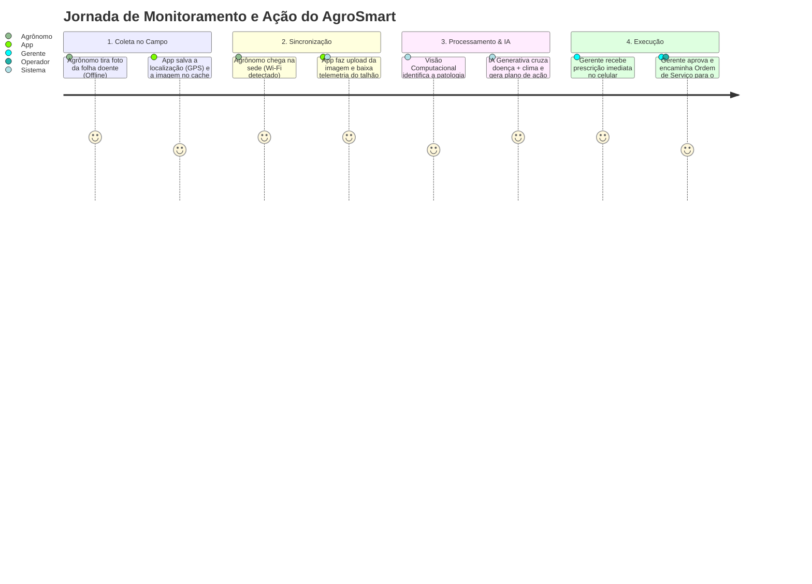
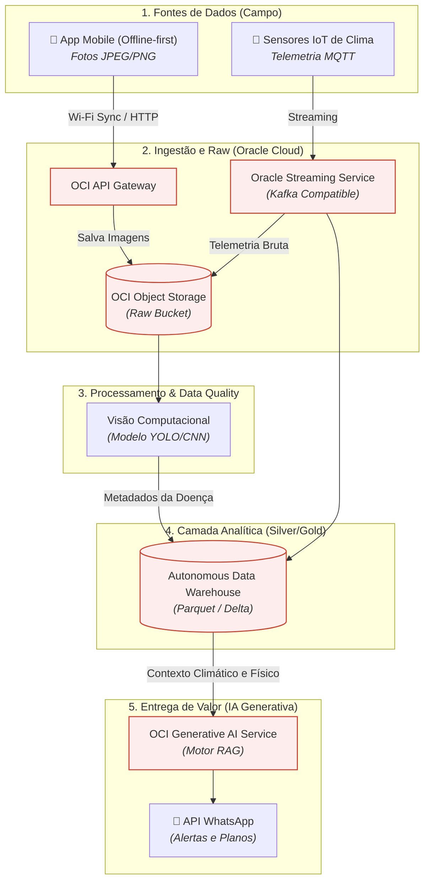
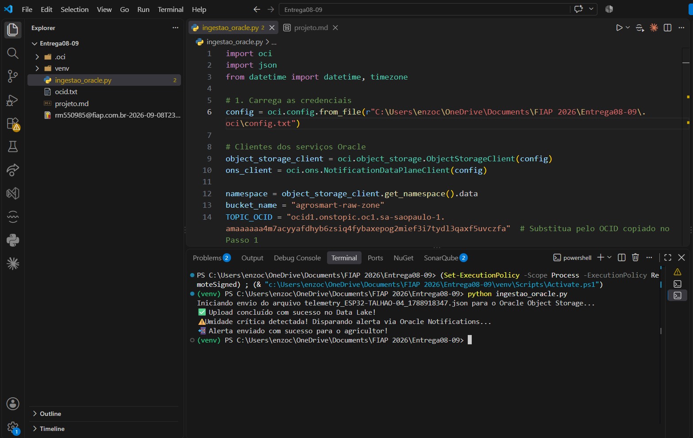
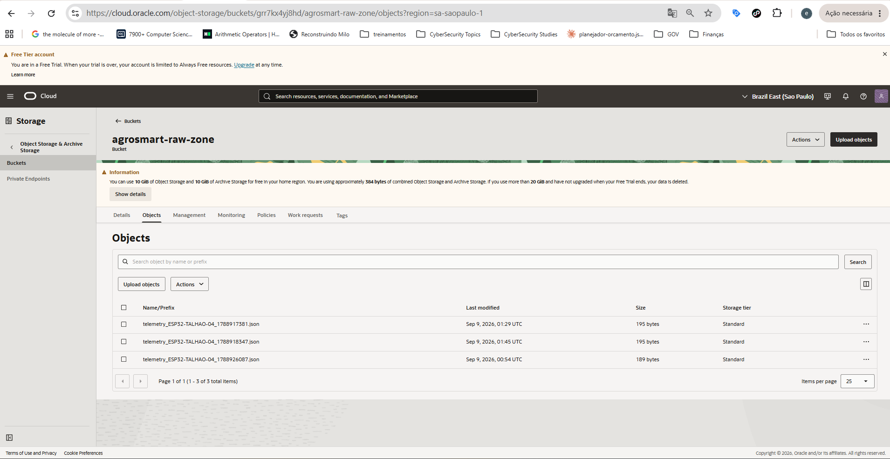
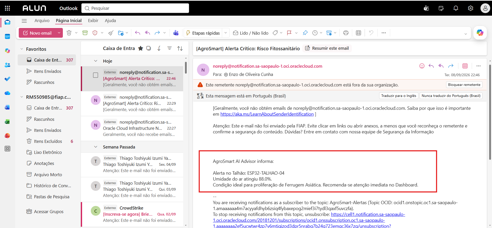

# Enterprise-Challenge-Startup-One

# Evolução do Projeto: AgroSmart / AgroVisionAI

## Parte 1: Refinamento do Problema

**O Problema Reestruturado**
A detecção tardia e o tratamento genérico de pragas e doenças foliares (como a Ferrugem Asiática) em médias e grandes lavouras resultam na aplicação excessiva e desnecessária de defensivos químicos. Isso gera altos custos financeiros operacionais e impactos ambientais severos no ecossistema local.

**Público-Alvo (Persona Detalhada)**
* **Nome:** Roberto, 42 anos, Gerente Agrícola e Engenheiro Agrônomo.
* **Contexto:** Gerencia propriedades acima de 1.000 hectares. Passa 70% do tempo no campo e 30% no escritório.
* **Dores:** Não possui braço operacional para inspecionar todos os talhões diariamente. Depende de aplicações "preventivas" baseadas no calendário, gastando fortunas com produtos químicos por não saber o momento ou local exato do foco da doença.
* **Necessidades:** Informações mastigadas, rápidas e acionáveis. Não quer passar horas analisando gráficos complexos; precisa de planos de ação diretos.

**Justificativa Estratégica**
Resolver a ineficiência na aplicação de defensivos ataca diretamente o maior custo variável do produtor rural (insumos). Além da alta viabilidade financeira e do forte apelo comercial, a solução atende às pressões globais por sustentabilidade e governança ambiental (ESG), facilitando a captação de recursos e a exportação da safra para mercados exigentes.

---

## Parte 2: Validação Estruturada

**Metodologia de Validação**
Aplicação de formulário online direcionado a 20 produtores rurais de médio e grande porte, complementado por entrevistas em profundidade via videochamada com 5 agrônomos de cooperativas regionais.

**Principais Aprendizados Obtidos**
* **Conectividade é o maior gargalo:** 80% dos entrevistados relataram que o sinal 4G/3G no meio da lavoura é inexistente ou altamente intermitente, inviabilizando sistemas que dependem de nuvem em tempo real no campo.
* **Ação vs. Dados Brutos:** Os agrônomos não querem um painel apenas informando "Ferrugem detectada". A necessidade real é saber "o que aplicar, que horas aplicar e se a janela de chuva permite a aplicação".

**Ajustes na Proposta Inicial (Pivô do MVP)**
A validação exigiu um pivô na abordagem técnica: o aplicativo mobile passará a ter arquitetura **Offline-First**. O produtor captura as fotos das folhas no campo sem internet; o aplicativo salva em cache local e sincroniza automaticamente com o Data Lake assim que detectar rede Wi-Fi na sede da fazenda. Além disso, a entrega de valor principal migrará do Dashboard Web para **Alertas via WhatsApp/SMS**, entregando a decisão já processada diretamente no celular do responsável.

**Atualização do Mapa de Stakeholders (Rich Picture)**
* **Adição de novo ator-chave:** O *Operador do Pulverizador*. Ele é o executor final da decisão gerada pela IA. O sistema agora prevê a geração de uma versão simplificada do relatório, atuando como uma "Ordem de Serviço" digital que o gerente pode encaminhar diretamente para o tratorista.

---

## Parte 3: Estruturação da Solução

**Descrição da Solução Proposta**
O **AgroSmart AI Advisor** atua como um copiloto agronômico autônomo. A plataforma cruza imagens capturadas no campo (analisadas por modelos de Visão Computacional) com telemetria climática de sensores IoT. Utilizando Inteligência Artificial Generativa (RAG), o sistema emite planos de ação e prescrições de pulverização em tempo real, baseados em literatura agronômica validada.

**Produto Mínimo Viável (MVP)**
* **Funcionalidades Essenciais:**
  * App Mobile (Offline-first) para captura e upload assíncrono de fotos de folhas por talhão.
  * Ingestão de dados contínuos de 1 sensor IoT de umidade/temperatura por talhão.
  * Motor de Visão Computacional (identificação restrita às doenças críticas: Ferrugem Asiática, Mancha Alvo e Oídio).
  * Geração de 1 Relatório de Ação Prescritivo via IA Generativa, disparado por WhatsApp para o gerente.

**Diferencial Competitivo**
A maioria das *agtechs* concorrentes oferece imagens de satélite (baixa resolução temporal/espacial para folhas) ou sensores IoT isolados. O AgroSmart une a prova visual (foto da folha) ao microclima exato do talhão (sensor IoT) e entrega a solução pronta (ação) usando a base de conhecimento da Embrapa. O sistema atua como um agrônomo virtual assistente, e não apenas como um monitor de painéis.

**Mapa da Jornada do Usuário**

## Parte 4: Estrutura Tecnológica e Integração com a Oracle

**Arquitetura Inicial da Solução**
A arquitetura é baseada no modelo de Data Lakehouse (camadas Raw, Trusted e Refined). A ingestão ocorre em tempo real via streaming para os sensores e em lote (batch) para as imagens mobile. O processamento separa a carga de inferência visual (redes neurais) da carga de processamento de linguagem natural (LLM), centralizando as decisões em um banco de dados analítico estruturado.

**Escalabilidade**
A solução utiliza arquitetura orientada a eventos e serviços gerenciados em nuvem. Essa abordagem permite iniciar o MVP com poucos talhões monitorados a um custo mínimo e escalar de forma elástica para processar dados de milhares de fazendas simultaneamente. Serviços *serverless* e bancos de dados autônomos garantem que o sistema absorva picos de carga (ex.: envio massivo de fotos ao final do dia) sem indisponibilidade.

**Tecnologias Oracle Incorporadas e Justificativas**

1. **Oracle Object Storage (Camada Raw/Bronze):**
   * **Justificativa:** Hospeda as imagens capturadas pelo app mobile e os arquivos JSON de telemetria brutos de forma imutável. Fortalece o projeto por oferecer altíssima durabilidade e integração direta com ferramentas de IA, atuando como a porta de entrada segura do Data Lake.
2. **Oracle Streaming Service (OSS):** 
   * **Justificativa:** É 100% compatível com Apache Kafka. Absorve os dados de telemetria dos sensores IoT no campo em tempo real sem a necessidade de provisionar ou gerenciar infraestrutura, garantindo que leituras climáticas não sejam perdidas durante oscilações de rede.
3. **OCI Generative AI Service (Motor do Copiloto RAG):**
   * **Justificativa:** Hospeda modelos fundacionais de linguagem (LLMs) em ambiente privado dentro do ecossistema Oracle. Fortalece o projeto estrategicamente ao garantir o sigilo absoluto dos dados de produtividade e histórico de pragas dos produtores rurais, algo que APIs públicas não garantem.

**Diagrama Arquitetural Atualizado (Integração OCI)**

## Evidências de Integração e Execução do MVP

Abaixo estão as comprovações do fluxo completo da solução: ingestão de telemetria, armazenamento no Data Lake da Oracle (OCI) e disparo autônomo do relatório prescritivo.

**A. Execução do Script de Ingestão e Motor de Regras**
*(Nesta etapa, o script Python simula o envio do payload do sensor para a nuvem e valida o risco fitossanitário).*

**B. Integração com Oracle Cloud Infrastructure (Object Storage)**
*(O arquivo JSON bruto de telemetria sendo persistido com sucesso na camada Raw do Data Lake).*

**C. Entrega de Valor: Alerta do Copiloto Agronômico**
*(O gatilho de umidade > 85% acionou o envio imediato do plano de ação para o gerente agrícola, materializando o conceito do AI Advisor).*

